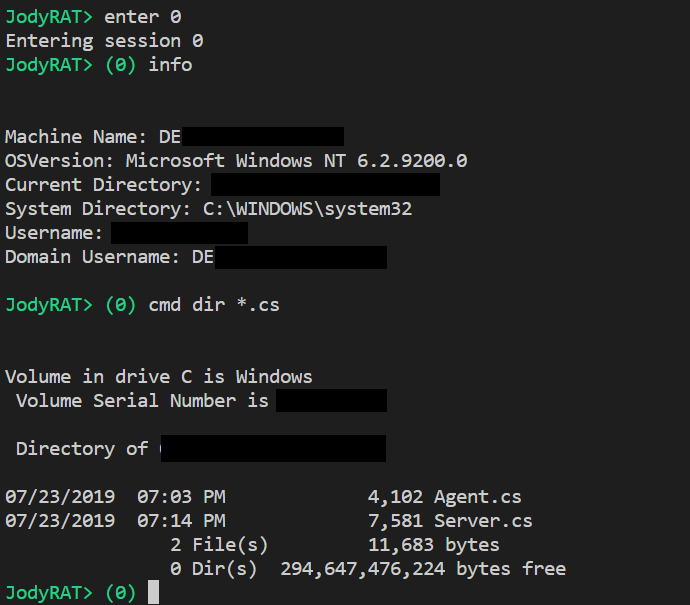

## JodyRAT

*JodyRAT* is a proof of concept remote administration tool. It is a work-in-progress, developed for the following purposes:
* create a useful remote agent for controlling machines compromised in the course of a *legitimate* penetration test
* learn more about C# and .NET

#### Screenshots

*This software may be used for any educational or other legal purpose. Please do not use it for crimes. Never gain or maintain access to other peoples' computers without explicit permission.*

### Current Features
* Run both server and client on Windows or Linux (requires Mono)
* Build without Visual Studio
* List remote sessions `list`
* Interact with a session `enter <id>`
* Within a session:
    * Back to main menu `back`
    * System information `info`
    * Command execution `cmd <command>`

### Build Notes
* Both Server.cs and Agent.cs contain a constants class in which the IP address and port of the server can be specified.
* To build on Windows (powershell): `& $env:windir\Microsoft.NET\Framework\v4.0.30319\csc.exe /nologo /target:exe /platform:x86 /main:Agent /out:agent.exe Agent.cs`

### TODO
* Agent to try calling home repeatedly if the server doesn't answer at first (with delay increasing to a configurable maximum)
* Automated testing
* Encrypted communication
* Drop into shell `shell`
* Upload/download files `get <src> <trg>` / `put <src> <trg>`
* Persistence

### Licence 
CC BY 4.0 - https://creativecommons.org/licenses/by/4.0/
